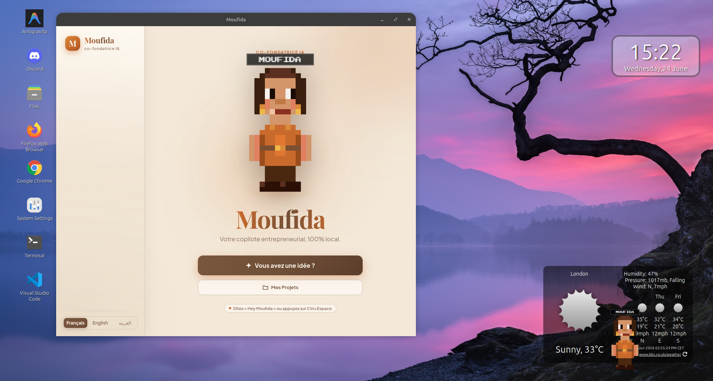
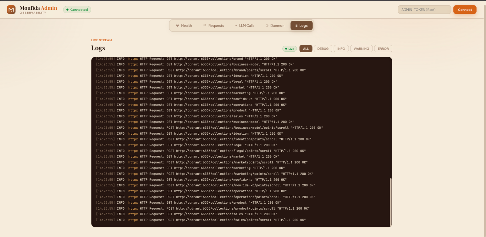
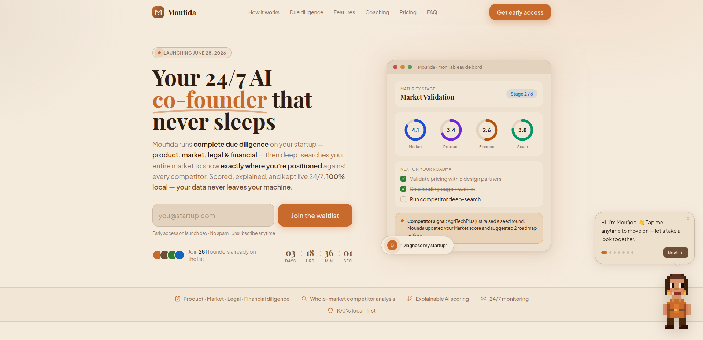

<div align="center">

<!-- GIF placeholder: replace with actual animated pixel-art Moufida GIF -->


# Moufida — مفيدة

**The first 100% local AI diagnostic platform built for Tunisian entrepreneurs.**

*Built by Team Makrouna Kadheba · AINS 2026 Hackathon*

[](LICENSE)
[](https://python.org)
[](https://golang.org)
[](https://rust-lang.org)
[](https://reactjs.org)
[](https://tauri.app)

</div>

---

## What Is Moufida?

Most startup tools tell founders what to do. Moufida tells them **why their idea stands or falls** — with academic rigour, real Tunisian ecosystem resources, and a live AI companion that never sleeps.

Moufida is a voice-first, 100% locally-run desktop AI that lives in your system tray. You describe your startup, and it produces a full diagnostic: a maturity assessment, five evidence-weighted composite scores, a named bottleneck analysis, a ranked blocker list, and a personalised roadmap linking real Tunisian support programmes. It keeps watching your market, your competitors, and your regulatory environment in the background — even when the app is closed.

**Everything runs on your machine. No data ever leaves your computer.**

> "Moufida" (مفيدة) is Arabic for "useful." The name is a commitment.

---

## Why Moufida Is Different

Most AI business tools are wrappers around a chat API. Moufida is an **analytical engine**:

| Other tools | Moufida |
|---|---|
| LLM generates advice from training data | Every claim traced to a real KB resource or academic formula |
| Single score or vague assessment | Five composite scores with explainable sub-dimension breakdowns |
| Fixed questionnaire | Adaptive CAT intake: converges in 8–15 questions vs. 30+ |
| Advice for US/EU startups | 83 curated resources specific to the Tunisian ecosystem |
| One-time snapshot | Continuous: daemon watches competitors, grants, and regulations 24/7 |
| Cloud-dependent | 100% local: Ollama, Whisper, Piper — no data leaves your machine |
| Black-box reasoning | Concept Bottleneck Layer: names the exact concept holding each score back |

---

## Screenshots

| Desktop App | Admin Observability Panel | Landing Page |
|:---:|:---:|:---:|
|  |  |  |

---

## Features & Components

Moufida is not a monolith — it's a collection of opinionated subsystems, each doing one thing well. Here's the full cast.

### The Orchestrator — Central Nervous System

*18 API routers, one FastAPI process, unlimited ambition.* The orchestrator is Moufida's brain: it runs the adaptive intake, fans out diagnosis across ten axis services in three dependency-ordered waves, executes the CBM pass, coordinates tool enrichment, detects logical contradictions in your profile, and streams live score updates to the app — all within a single request lifecycle. It also logs every downstream LLM call with a correlated `request_id` because accountability is a design principle, not an afterthought.

→ [Orchestrator deep-dive](docs/components/orchestrator.md)

### Creation Mode — Build a Startup From an Idea

You type "I want to make an app that helps bakeries manage inventory" and Moufida builds you a nine-axis business plan backed by real evidence. Each axis (Ideation → Market → Product → Brand → Business Model → Legal → Operations → Marketing → Sales) is generated with KB citations and live SearXNG web search results. You approve, edit with constraints, or retry. When all nine axes are approved, Moufida finalises a three-horizon roadmap linked to real Tunisian support programmes. Every claim has a source.

### 10 Axis Services — The Expert Panel

*Ten FastAPI microservices that each believe they are the most important one.* Each service covers one diagnostic dimension and runs in two modes: diagnose an existing startup or generate a plan section for a new one. They run in three dependency-ordered waves — no service touches go-to-market before business model and operations have spoken. Axes within each wave run in parallel via `asyncio.gather`.

→ [Axis services deep-dive](docs/components/axis-services.md)

### Diagnosis Mode — Know Exactly Where You Stand

You describe your startup. Moufida runs an adaptive questionnaire (8–15 questions, not 30, because your time is valuable) using Computerized Adaptive Testing with 2PL IRT and Bayesian EAP estimation — each question is chosen to maximise information about *your* specific profile. Then it produces the full picture:

- **Maturity stage** — Ideation through Scale, with the evidence that justifies the call
- **Five composite scores** — Market, Commercial Offer, Innovation, Scalability, Green — each broken into named sub-dimensions with evidence-tier weights (`cᵢ = wᵢ × vᵢ × mᵢ`)
- **Concept Bottleneck** — the exact concept holding each axis score back, with its projected lift
- **Blockers & anomalies** — ranked issues plus 10 contradiction detectors (e.g., revenue claimed with zero customer interviews)
- **Personalised roadmap** — three-horizon action plan citing real Tunisian programmes

→ [CAT/IRT research](docs/research/adaptive-testing.md)

### Affinitree — The Deterministic Scoring Engine

*A scoring formula so transparent you could audit it on a napkin.* Every axis score is `Σ wᵢ × vᵢ × mᵢ` where `mᵢ` is the evidence-tier multiplier — self-reported fields score at 0.6×, artefact-backed at 1.0×, daemon-observed at 1.2×. Run the same profile twice and you get the exact same score, always. This determinism is intentional: when a human expert locks an override via Score Debate, it means something, because the baseline never moves on its own.

| Score | Owner Service | Academic Grounding |
|---|---|---|
| **Market** | market-intelligence | Kotler & Keller (2016), Blank (2013) |
| **Commercial Offer** | product-offering | Osterwalder et al. (2014) |
| **Innovation** | brand-innovation | OECD Oslo Manual (2018) |
| **Scalability** | business-model + operations | Ries (2011), Christensen (1997) |
| **Green** | legal-compliance | EU AI Act, GDPR, SDG framework |

→ [Scoring engine deep-dive](docs/components/scoring-engine.md)

### Signal Service — The Interpretability Layer

*Three research papers, one Rust microservice, zero black boxes.* The Signal service is where the science lives. It implements Label-Free Concept Bottleneck Models (Oikarinen et al., ICLR 2023) — the LLM scores named concepts per axis, a calibrated linear layer turns them into the score, and the weakest concept is named with its projected lift. It also implements Contrastive Axis Direction Probes (Zou et al., RepE 2023) — nine unit vectors in `bge-m3` space that make RAG retrieval axis-aware rather than just query-similar.

```
Market score: 2.3/5
  TAM Evidence       ████████░░  0.62  ×0.20
  ICP Specificity    ██░░░░░░░░  0.18  ×0.35  ← Bottleneck
  WTP Signal         █████░░░░░  0.38  ×0.25
  Competitive Diff.  ███████░░░  0.54  ×0.10
  Market Timing      ██████████  0.80  ×0.10

  → Fixing ICP from 0.18 → 0.60 moves market score to 3.1
```

→ [CBM research](docs/research/concept-bottleneck.md) · [Axis directions research](docs/research/axis-directions.md) · [Signal service docs](docs/components/signal-service.md)

### RAG & Knowledge Base — 83 Real Tunisian Resources

*No hallucinated programme names. Every grant is real. Every institution exists.* The RAG service uses hybrid retrieval: dense (Qdrant cosine similarity) + sparse (BM25) + Reciprocal Rank Fusion + axis-direction re-ranking (30% blend) + sector boost (1.3×). The knowledge base covers the actual Tunisian startup ecosystem: APII, Smart Capital, StartupAct, INNORPI, BFPME, BTS, Carthage Business Angels, CEPEX. When Moufida cites a programme, you can go apply to it.

→ [RAG & KB deep-dive](docs/components/rag-and-knowledge-base.md)

### Go Daemon — The One That Never Sleeps

*Six watchers, one sophisticated supervisor loop, zero babysitting required.* After your first diagnosis, a Go background service monitors your competitive landscape, funding deadlines, and regulatory environment continuously. Switch focus to a different project and the supervisor tears down the current watcher batch (`context.CancelFunc` + `sync.WaitGroup`) and spins up a fresh one — in-process, no restart needed.

| Watcher | Frequency | What it delivers |
|---|---|---|
| Competitor | Every 12h | SWOT updates, competitor page changes, pricing moves |
| Grant Radar | Daily | Matched funding calls from APII, BFPME, Wamda, EU |
| Legal Radar | Daily | Regulatory updates from JORT, INNORPI, EUR-Lex |
| Trend | Weekly | Market trend shifts for your sector |
| Milestone | Daily | Upcoming roadmap deadline reminders |
| Budget | Every 6h | Burn rate / runway alerts |

→ [Daemon deep-dive](docs/components/daemon.md)

### Tool Integrations — Evidence That Actually Counts

*Self-reporting "my MVP exists" scores 40% less than GitHub proving it.* Moufida's three-tier evidence model creates a concrete incentive to connect real tools. Supported integrations: GitHub, Notion, Google Sheets, Google Analytics, Slack (push), Composio (managed OAuth — no credentials stored client-side). Connect GitHub and your `product.mvp_existence` field goes from T1 (×0.6) to T3 (×1.2), doubling its contribution to your product score.

→ [Tool integrations deep-dive](docs/components/tool-integrations.md)

### Advanced Analytical Features

**Investor Pitch Simulator** — Practice against an AI Seed VC, Angel, Impact Fund, or Strategic investor whose questions come exclusively from your actual diagnostic data — no generic softballs. Ends with a readiness report and prep actions you can push to your roadmap.

**Pivot Scenario Planner** — Override parameters ("what if I pivot to B2B?", "what if I lower price?") and see the projected score delta on all nine axes with confidence levels and KB citations. Adopt a scenario to re-diagnose with the changes applied.

**Customer Persona Simulator** — Generate three evidence-grounded Tunisian customer personas from your market/product/brand data. Chat with each one to hear realistic objections, buying triggers, and a close-strategy card.

### Desktop App & Pixel-Art Companion

*A Tauri app, a voice pipeline, and a tiny animated character who judges your burn rate.* Built with React 18 + TypeScript inside a Rust Tauri v2 shell, it lives in the system tray and talks to the backend over HTTP and SSE. Wake it with "Hey Moufida" or Ctrl+Space, speak in French/English/Tunisian Darija, get spoken answers back via Whisper + Piper/Kokoro. The pixel-art companion has 24 expressive states and 5 palette themes — she celebrates milestones, looks worried at critical burn rate alerts, falls asleep when the daemon is paused, and accepts PDFs via drag-and-drop to ingest them straight into the knowledge base.

→ [Desktop app deep-dive](docs/components/desktop-app.md)

### Local AI Models — Your Data Never Leaves

*Six models, zero API keys, one machine.* Everything runs on your hardware: `llama3.1:8b` for generation (~4.7 GB), `bge-m3` multilingual embeddings (~1.2 GB), Whisper large-v2 Q5 for STT (~1.1 GB), Piper FR + Kokoro-82M for TTS, fastText LID for language detection in under 1 ms. With 8 GB VRAM: 40–80 tok/s. CPU-only: still works, just slower. Your startup data never touches an external server.

→ [Models docs](docs/components/models.md)

### Admin Observability Panel

*For when "trust me, it works" isn't good enough for a demo.* A standalone SPA at `:3002` that turns every HTTP request into a distributed trace — click any row to see every downstream LLM call, its prompt hash, token counts, and latency. Watch a live diagnosis unfold at DEBUG level. Verify the daemon's evidence tier upgrades. See exactly which axis ran in which wave. Built because production-readiness means being observable, not just functional.

→ [Admin & web interfaces docs](docs/components/web-interfaces.md)

---

## Repository Structure

```
backend/
  orchestrator/         FastAPI brain — 18 routers, CAT intake, LangGraph (:8001)
  scoring-engine/       Affinitree deterministic scoring library + HTTP API (:8200)
  rag/                  Knowledge-base RAG service — hybrid retrieval + SearXNG (:8300)
  services/             10 axis FastAPI services — dual-mode generate + diagnose (:8101–8110)
  eval/                 Three-tier evaluation framework (T1/T2/T3)

signal/                 Rust interpretability service — CBM + Axis Direction Probe (:8010)
daemon/                 Go monitoring daemon — supervisor + 6 adaptive watchers
db/migrations/          20 SQL migrations (auto-run by db-migrate service)
admin/                  Standalone Vite + React observability SPA (:3002)
frontend/               Tauri + React/TS desktop app (host-side, not in Docker)
landing/                Next.js 14 landing page + waitlist
marketing/              Static marketing HTML page
models/                 Local AI models (Whisper, Piper FR, Kokoro-82M, fastText LID)
scripts/                Setup, KB generation, ingestion, evaluation, smoke tests
docs/
  components/           12 component docs (orchestrator, axis services, scoring, RAG, signal, daemon, DB, desktop, tools, models, web, overview)
  research/             3 research papers rewritten with accessible math (CBM, axis directions, CAT/IRT)
  assets/               Screenshots and demo assets
docker-compose.yml      Full backend stack definition
.env.example            Environment template
manual.md               Non-technical user manual for the desktop app
```

---

## Prerequisites

### Required Software

| Tool | Version | Purpose | Install |
|---|---|---|---|
| Docker + Compose | 24+ | Runs all backend services | [docs.docker.com](https://docs.docker.com/get-docker/) |
| Ollama | Latest | Serves LLMs and embeddings locally | [ollama.com/download](https://ollama.com/download) |
| Node.js | 20+ | Builds the Tauri frontend | [nodejs.org](https://nodejs.org/) |
| Rust + Cargo | Stable | Required by Tauri | [rustup.rs](https://rustup.rs/) |
| Tauri CLI | v2 | `tauri dev` / `tauri build` | `cargo install tauri-cli` |

**Tauri system dependencies (Ubuntu/Debian):**
```bash
sudo apt update && sudo apt install -y \
  libwebkit2gtk-4.1-dev build-essential curl wget file \
  libxdo-dev libssl-dev libayatana-appindicator3-dev librsvg2-dev
```

---

## Setup

### Step 1 — Clone and configure environment

```bash
git clone https://github.com/ghassenov/moufidaa.git
cd moufidaa
cp .env.example .env
```

The `.env` defaults work out of the box. Optional overrides:

| Variable | Purpose |
|---|---|
| `COMPOSIO_API_KEY` | Enable Composio tool integrations (free tier at [app.composio.dev](https://app.composio.dev)). Leave empty to use manual-token tools only. |
| `ADMIN_TOKEN` | Password-gate the observability panel at `:3002`. Leave empty for open local access. |
| `SIGNAL_URL` | Defaults to `http://signal:8010`. Leave as-is. |

### Step 2 — Install Rust, Tauri, and Node.js

```bash
# Rust
curl --proto '=https' --tlsv1.2 -sSf https://sh.rustup.rs | sh
source "$HOME/.cargo/env"

# Tauri CLI
cargo install tauri-cli

# Node.js 20 via nvm
curl -o- https://raw.githubusercontent.com/nvm-sh/nvm/v0.39.7/install.sh | bash
nvm install 20 && nvm use 20

# Ollama
curl -fsSL https://ollama.com/install.sh | sh
```

### Step 3 — Download models and voice assets

```bash
./scripts/setup.sh
```

What this downloads:

| Asset | Size |
|---|---|
| `llama3.1:8b` (via Ollama) | ~4.7 GB |
| `bge-m3` multilingual embeddings (via Ollama) | ~1.2 GB |
| `models/lid.176.ftz` (fastText LID) | ~1 MB |
| `models/piper-fr.onnx` (French TTS) | ~61 MB |
| `models/kokoro/model_quantized.onnx` (TTS engine) | ~89 MB |
| `models/kokoro/voices/` (voice files) | ~1 MB |
| `models/whisper.bin` (Whisper large-v2 Q5) | ~1.1 GB |

To skip the 1.1 GB Whisper download and set it up later:
```bash
./scripts/setup.sh --skip-whisper
```

> **Wake word (optional):** "Hey Moufida" requires a free [Picovoice](https://console.picovoice.ai/) account. The setup script prints exact steps. Without it, use `Ctrl+Space` to activate voice.

### Step 4 — Start the backend

Make sure Ollama is running (`ollama serve`), then:

```bash
docker compose up --build
```

This starts: PostgreSQL (migrations run automatically), Redis, Qdrant, SearXNG, the orchestrator, 10 axis services, the RAG service, the Go daemon, the Affinitree scoring engine, the Rust signal service, and the admin panel.

Verify everything is healthy:
```bash
curl http://localhost:8001/health   # orchestrator
curl http://localhost:8300/health   # RAG service
curl http://localhost:8200/health   # scoring engine
curl http://localhost:8010/health   # signal (Rust)
curl http://localhost:8102/health   # market-intelligence axis
```

The **admin panel** is now live at [http://localhost:3002](http://localhost:3002).

### Step 5 — Ingest the knowledge base (first time only)

```bash
# Optional: regenerate resource JSON from source scripts
python scripts/generate_kb.py        # 65 Tunisian ecosystem resources
python scripts/generate_kb_axis.py   # 18 multilingual per-axis resources

# Embed all resources into Qdrant
./scripts/ingest-kb.sh
```

Then compute the axis-direction vectors for axis-aware retrieval re-ranking (requires the KB to be ingested first):

```bash
docker compose --profile tools run --rm compute-directions
```

Until this runs, retrieval falls back to standard BM25+dense RRF — nothing breaks.

### Step 6 — Run the desktop app

In a new terminal:

```bash
cd frontend
npm install        # first time only
npm run tauri dev  # starts Vite on :5173, opens the system tray app
```

The app window is hidden at startup — click the tray icon to open the dashboard.

> **Do not run `docker compose --profile web up`** at the same time as `npm run tauri dev` — both use port 5173 and will conflict.

---

## Smoke Tests

After the stack is up and the KB is ingested:

```bash
# Diagnosis pipeline — end-to-end STATE_EXISTING test
./scripts/phase2-smoke-test.sh

# Creation loop, events, KB, provenance, project delete
./scripts/phase3-smoke-test.sh
```

---

## Evaluation

```bash
# Run all evaluation tiers
./scripts/run-all-evals.sh
```

| Tier | Component | Metric | Target | Status |
|---|---|---|---|---|
| T2a | Scoring determinism | 10-run identity | 100% | ✅ Pass |
| T2c | Anomaly detection recall | 10 contradictions | 100% | ✅ Pass |
| T2b | Rubric LLM stability | σ ≤ 0.15/field | ≤ 0.15 | Needs Ollama |
| T1 | Maturity classifier | Macro-F1 ≥ 0.65 | ≥ 0.65 | Needs Ollama |
| T3 | RAG retrieval | Recall@3 ≥ 0.80 | ≥ 0.80 | Needs Qdrant + Ollama |

---

## Scoring Engine — Standalone

The Affinitree scoring engine also runs as a standalone HTTP service at `:8200`:

```bash
# All five composite scores
curl -X POST http://localhost:8200/score/all -d @profile.json

# Anomaly detection
curl -X POST http://localhost:8200/detect -d @profile.json
```

To run unit tests directly:
```bash
cd backend/scoring-engine
uv venv && uv pip install -e ".[dev]"
.venv/bin/python -m pytest -q
```

---

## User Manual

For a non-technical walkthrough of every screen, button, and background event in the desktop app, see [`manual.md`](manual.md).

---

## License

MIT — see [`LICENSE`](LICENSE).