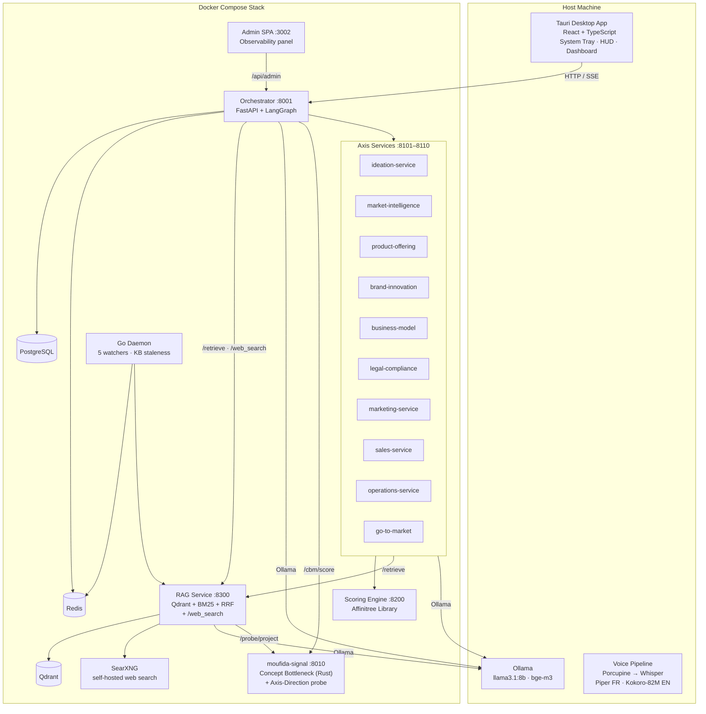

# Moufida — مفيدة

**An intelligent, voice-first entrepreneurial companion for Tunisian founders.**

Moufida (Arabic for "useful") lives in your system tray. You wake it by saying *"Hey Moufida"*, describe your startup by voice, and it replies by speaking back — in French or English. Everything runs on your own machine. No data leaves your computer.

Built for Team Makrouna Kadheba · June 2026 hackathon submission.

---

## What it does

Moufida covers two modes of use, keeps itself up to date in the background, rehearses founders against an AI investor, and exposes its own internals through a live observability panel.

### Creation mode (got an idea?)

Type or say your idea. Moufida generates a full nine-axis startup plan — ideation, market, product, brand, business model, legal, operations, marketing, sales — one section at a time. After each section you **Approve**, **Edit with constraints** (re-generate), or **Retry**. When all axes are approved, it finalises a personalised roadmap grounded in 65 real Tunisian support programmes and exports the complete plan to PDF.

### Diagnosis mode (existing project)

Describe your current situation. Moufida asks adaptive follow-up questions, then produces:

- A **maturity stage** (Ideation → Market Validation → Structuration → Fundraising → Launch Planning → Growth) with evidence points
- Five **composite scores** — Market, Commercial Offer, Innovation, Scalability, Green — each broken down into sub-dimensions with weights, evidence tiers, and plain-language justifications
- A **concept breakdown** per axis (Concept Bottleneck layer) — each axis score is decomposed into named micro-concepts and the single **bottleneck** concept holding it back is surfaced, with the projected score if it were fixed
- A ranked list of **priority blockers** (critical / warning / info)
- A personalised **roadmap** linking real Tunisian support programmes, financing options, and guides to your specific gaps
- Automatic **anomaly detection** that flags contradictory signals (e.g. revenue claimed with zero customer interviews)
- **PDF upload** — upload a pitch deck or business plan; Moufida extracts text as evidence
- **Score Debate** — challenge any score in chat; if Moufida is convinced, the score updates and the reason is logged
- **History compare** — diff any two diagnostic runs to see which blockers were resolved and how scores moved

### Continuous liveness

After the first diagnosis, Moufida stays alive and reacts to four update sources:

| Source | Example |
|---|---|
| **Manual edit** | You update a plan section in the UI |
| **Chat intent** | You tell Moufida "we pivoted to B2B" |
| **Tool signal** | A connected GitHub/Notion/Sheets/Analytics integration pushes a change |
| **Daemon event** | The background Go daemon detects a market shift or milestone |

Every update triggers a dependency-aware re-run of only the affected axes (resolved by a transitive graph engine). Each change is logged as an **Event Card** — you can **Apply** (auto-rerun downstream), **Handle myself**, or **Ignore**. Every card carries a field-level diff showing what changed. The **"What's new?"** summary gives you a one-paragraph LLM digest of recent activity.

### Adaptive roadmap

The roadmap tracks three horizons (immediate / short-term / medium-term). Checking off all actions in the active horizon prompts Moufida to generate the next horizon's actions. When a score drops ≥1.0 between diagnostics, the affected axes' actions are flagged for priority review. If the knowledge base changes (new document, tool data, daemon event), the roadmap is marked stale and you can regenerate it — provenance (KB version, trigger, sources) is shown per generation.

### Interpretability layer (`moufida-signal`)

A standalone **Rust microservice** (`:8010`) implements two research papers that make scoring and retrieval transparent rather than black-box:

- **Concept Bottleneck** (Koh et al., ICML 2020 — Label-Free variant, Oikarinen et al., ICLR 2023): each axis score flows through a layer of named, human-readable concepts (`market` → TAM evidence, ICP specificity, WTP signal, …). A calibrated linear head turns those concepts into the score, so the UI can show **exactly which concept is the bottleneck** and the projected lift from fixing it. Weights start from domain priors and **calibrate from your diagnostic history** via ridge regression.
- **Contrastive Axis Directions** (Representation Engineering, Zou et al., 2023): nine axis directions are learned in the `bge-m3` embedding space; every retrieved KB chunk is projected onto them, so retrieval is **axis-aware** (a chunk that is "business-model, not market" is down-weighted for the market axis) and new documents are auto-tagged to axes.

See [`docs/research/`](docs/research/) for the full design write-ups.

### Advanced analytical features (Phase H)

- **Investor Pitch Simulator** — spar against an AI investor persona (Seed VC / Angel / Impact / Strategic) whose hard questions are grounded **only** in your own diagnostic data (scores, blockers, competitor board, opportunities). Ends with a **readiness report**: per-axis readiness, hardest questions, and prep actions you can push to the roadmap.
- **Pivot Scenario Planner** — define up to three "what-if" parameter overrides (segment, revenue model, pricing, market) and see the **projected score delta on all nine axes**, each with a confidence level and cited reasoning. Adopt a scenario to patch the profile and re-diagnose.
- **Customer Persona Simulator** — generate 3–5 evidence-grounded customer personas from your market/product/brand axes + KB, then **chat with each one** to hear realistic objections and buying triggers; an objection tracker and a close-strategy card help you prepare.
- Every generated claim in these features is rendered with an **EvidenceTrace** — a collapsible source chain (axis field, KB doc, competitor snapshot, daemon signal) so nothing is an unverifiable hallucination.

### Observability & admin panel (Phase H)

A separate, browser-only **admin SPA** (`http://localhost:3002`) gives a live, read-only view into Moufida's internals — the demo's production-readiness signal:

- **Service health** — Postgres / Redis / Qdrant / Ollama / SearXNG / daemon latency + status, plus per-axis KB health (doc counts, staleness).
- **Request log + distributed trace** — every orchestrator request is recorded (method, path, status, duration); click any request to see its correlated **LLM calls** (model, token counts, prompt/response previews).
- **LLM call log**, **daemon activity log**, and a **real-time log stream** (SSE, colour-coded by level).
- Telemetry is captured by a request middleware (`X-Request-ID` propagated via a contextvar) writing to three Postgres tables; the panel is gated by an optional `ADMIN_TOKEN`.

---

## Core design principles

| Principle | How it is implemented |
|---|---|
| 100% local | All LLMs run via Ollama (llama3.1:8b, bge-m3 multilingual embeddings). Voice models (Whisper, Piper, Kokoro-82M) run locally. |
| Grounded generation | Creation-mode sections are grounded in per-axis RAG collections (multilingual AR/FR/EN) plus free self-hosted live web search (SearXNG); every section cites its KB and web sources. |
| Explainable scoring | Every score decomposes to a formula: `ci = wi × vi × mi` where `mi` reflects the evidence quality (declared × 0.6, verified document × 1.0, daemon-observed × 1.2). |
| Traceable resources | Every roadmap action links to a real, verified source URL. No hallucinated programme names. |
| Bilingual first-class | French and English supported throughout the voice pipeline. STT uses Whisper large-v2; TTS uses Piper (FR) and Kokoro-82M (EN). Language is auto-detected per utterance via fastText. |
| Liveness | The system updates itself from real-world signals even when you're not interacting with it. |

---

## Architecture



Datastores: PostgreSQL · Redis · Qdrant
Ollama (host): llama3.1:8b · bge-m3
Voice (host):  Whisper large-v2 · Piper FR · Kokoro-82M EN · fastText LID

---

## Five composite scores

| Score | Owner service | Sub-dimensions |
|---|---|---|
| Market | market-intelligence | Addressable market size, customer validation evidence, revenue model clarity, competitive intensity |
| Commercial Offer | product-offering | Value proposition clarity, product maturity, pricing coherence, differentiation |
| Innovation | brand-innovation | Product/tech novelty 35%, market novelty 25%, brand distinctiveness 20%, value-creation novelty 20% |
| Scalability | business-model + operations | Unit economics, funding readiness, revenue model, automation, supply-chain resilience, quality framework |
| Green | legal-compliance | GDPR compliance, AI Act compliance, IP protection, SDG alignment, environmental impact |

---

## Current state (as of June 2026)

### Fully implemented

**Core engines**
- **Scoring engine** — all five composite scores with full explainability trees. Formula `ci = wi × vi × mi` with evidence-tier multipliers. Anomaly detection 10/10 recall. 100% determinism across 10 repeated runs.
- **Axis services** — 9 axis `/diagnose` endpoints return real computed scores. Axis 10 (go-to-market) has a real RAG-augmented `/roadmap` endpoint. All 9 axes have a real `/generate` endpoint (dual-mode: `evaluate` + `generate`).
- **Dependency engine** — transitive re-run graph (`dependency.py`). Resolves the BM↔Operations SCC correctly. 12 unit tests, all passing.
- **Adaptive intake** — 10-question branching questionnaire (FR/AR). Sector-based branching. Merges answers into the profile.
- **RAG service** — hybrid retrieval (dense + BM25 + RRF + sector boost) over per-axis multilingual (AR/FR/EN) Qdrant collections, plus a `/web_search` endpoint backed by self-hosted SearXNG. 83 curated resources. Creation-mode `/generate` calls are grounded in KB + live web evidence and return clickable citations.
- **24/7 Go daemon (Phase F)** — a supervisor polls a DB control plane (pause flag + focused project), heartbeats for liveness, and **hot-swaps** project-scoped watchers when you change focus from the UI (no restart). Watchers (competitor, grant/deadline radar, legal, trend, milestone, budget) adapt their targets to the focused project's sector and profile, with an LLM-derived, cached per-project watch-target layer. The 2D companion character is the on/off switch (watching ↔ sleeping). See **[`manual.md`](manual.md)** for the full walkthrough.
- **Interpretability service `moufida-signal` (Rust, :8010)** — Concept Bottleneck scoring (`/cbm/score`, `/cbm/calibrate` ridge regression) and Contrastive Axis Direction probing (`/probe/project`, `/probe/install`). Best-effort: the diagnostic and RAG pipelines degrade gracefully if it is down. Unit-tested. See [`docs/research/`](docs/research/).
- **Observability telemetry (Phase H)** — a request middleware records every orchestrator call to `api_requests`; the shared `generate_json` LLM helper records every Ollama call to `llm_calls` (correlated by request id); daemon signals are mirrored to `daemon_activities`. Surfaced by the admin panel.

**Orchestrator API (all under `/api/v1`)**
- Project lifecycle: create, patch profile, list, delete
- Full diagnostic fan-out: 3-wave parallel, persisted, SSE-streamed
- **Creation loop**: `POST /generate/{axis}` → `POST /generate/{axis}/approve|retry` → `POST /finalize`
- **Plan document**: `GET /plan`, `POST /section/{axis}` (manual edit → event)
- **Diagnosis extras**: `POST /documents` (PDF **or text/markdown** upload), `POST /axis/{axis}/debate` (score recompute via chat), `GET /history/compare`
- **Knowledge base**: `GET /kb/resources` (browse the curated resources — proxied from the RAG service's disk-backed `/resources`, taxonomy included), `POST /kb` (add a project note)
- **Watch targets**: `GET /project/{id}/watch-targets`, `POST /project/{id}/watch-targets/refresh` (what the daemon monitors for a project)
- **Events**: `GET /events` (filterable REST list), `GET /events/stream` (SSE — a **distinct path** so the live stream no longer collides with the REST list), `POST /event/{id}/act|manual|ignore`, `GET /event/{id}/diff`, `GET /whats-new`
- **Roadmap engine**: `POST /roadmap/regenerate`, `POST /roadmap/advance`, `POST /kb`, `GET /roadmap/provenance`
- Chat endpoint detects update intent via LLM and auto-creates event when the user describes a pivot or change

**Frontend**
- **Navigation (restructured)** — sidebar pages: **Projects**, **Dashboard**, **Assistant (HUD)**, **Personas**, **Pitch**, **Scénarios**, **Base de Connaissances (KB browser)**, **Mon Parcours**, **Settings**. Personas / Pitch / Scénarios are now **dedicated pages** (no longer crammed onto the dashboard), each with its own per-page character costume.
- **Projects page** — a real portfolio reachable any time from the sidebar (not just the landing screen): per-project **Open**, **⚡ Diagnose**, **✎ Update profile** actions, daemon-focus toggle, delete, JSON import, and **＋ New project** — plus in-app project **switching** without a refresh. Opening a project goes straight to its dashboard (intake is now an explicit "Update profile" choice, not forced).
- **Creation flow** — nine-axis step-by-step generation with Approve / Edit (re-generate with constraints) / Retry; **per-axis narration** in Moufida's voice, a real **celebrate** on completion, and **resume-where-you-left-off** persistence. Completion screen with full plan document and PDF export.
- **Dashboard** — MaturityCard (with a **maturity-stage "level" ladder**), ScoreGauge (animated **count-up** + inline **"Débattre du score"** chat over `debateAxis`), **document upload** button, BlockerList, RecommendationsCard, "What's new?" digest, RoadmapTimeline, EventFeed, OpportunityRadar, CompetitorBoard, ConceptBreakdown.
- **HUD** — ChatPanel (grounded, update-aware, **history persisted** per project), ReviewCard (structured render — no raw JSON), AlertFeed, **WatchTargets** card (what the daemon monitors), **Add-knowledge** card, voice I/O.
- **Mon Parcours** — ScoreChart (time-series), **Achievements/badges**, **Compare diagnostics** card (over `compareHistory`), HistoryList, completed actions.
- **Knowledge Base browser** — browse the 83 curated resources with stage / type / sector filters and inline reading (over `GET /kb/resources`).
- **Single pixel character everywhere** — the SVG character was retired; the **pixel** Moufida is the only renderer, with a full pose/expression system (mouth/arms/accessories/particles for all 15 states), per-page palettes, and a **persistent floating companion** that reacts to app + SSE events (thinking on diagnostics, celebrating on milestones, worried on score drops, sleeping when the daemon is paused). Subtle Web-Audio sound cues accompany reactions.
- **SSE consumer** — connects to the dedicated `/events/stream`; handles `score_update`, `alert`, `roadmap_update`, `review_ready`, `maturity_update`, `event_new`, `kb_updated`, `horizon_complete`, `daemon_status`, `competitor_update`, `opportunity_new`, `watch_targets_updated`, `concept_update`; drives a sidebar **real-time connection indicator** and companion reactions.
- **Inline citations** — generated text renders `[n]` source markers as clickable links (graceful no-op when absent); the shared **EvidenceTrace** source-chain component backs the analytical pages.
- **Admin / observability SPA** — a separate Vite app (`admin/`, served on `:3002`) with Health, Requests + Trace, LLM Calls, Daemon Activity, and live Logs pages.
- **i18n** — full FR/EN/AR parity (~260 keys each), RTL layout.
- Tool integrations settings panel (Slack, Notion, Google Sheets, GitHub, Google Analytics).

**Tool integrations & the local-first trade-off (Phase G)**
- Two flavours of tool integration coexist: **hand-rolled** tools (you paste a
  token) and **Composio-backed** tools (`Notion (Composio)`, `Slack (Composio)`,
  …) that use Composio's **managed OAuth** — click *Connect*, authorise in a
  popup, no credentials pasted. Composio is **bidirectional**: a change in
  Notion/Slack flows back via a trigger → `tool_signals` → the affected axes
  re-run (Event Feed shows the diff).
- This integration **edge is the one deliberate exception to "100% local"**: the
  OAuth popup and trigger broker are hosted by Composio (the managed broker the
  product brief asked for). The diagnostic/scoring/RAG pipeline stays fully
  local — only the integration handshake is remote. Set `COMPOSIO_API_KEY` (free
  tier) to enable it; leave it empty and Composio tools simply report
  *unavailable* while the local token tools keep working.
- For NAT'd desktops with no public ingress, inbound triggers are **polled** by
  the Go daemon (`POST /integrations/poll` every ~5 min) instead of requiring an
  inbound webhook; the API key stays server-side in the orchestrator.

**Scripts**
- `scripts/setup.sh` — pulls models and voice assets
- `scripts/generate_kb.py` — (re)generates the 65 base Tunisian-ecosystem KB resources
- `scripts/generate_kb_axis.py` — (re)generates the 18 multilingual (AR/FR/EN) per-axis KB resources, each tagged with its `collection` (market, legal, product, …)
- `scripts/ingest-kb.sh` — ingests **all** KB resources into Qdrant, routing each to its collection and printing a per-collection chunk breakdown
- `scripts/migrate.sh` — applies all 20 DB migrations in order with a tracker table
- `scripts/compute_axis_directions.py` — computes the 9 axis-direction vectors from the ingested KB and installs them into `moufida-signal` (run after KB ingest)
- `scripts/phase2-smoke-test.sh` — end-to-end `STATE_EXISTING` pipeline test
- `scripts/phase3-smoke-test.sh` — creation loop, events, KB, provenance, delete
- `scripts/run-all-evals.sh` — all three eval tiers

### Not yet implemented / known gaps
- LangGraph state machine (graph nodes/edges compiled — `MoufidaState` TypedDict exists but no `StateGraph`)
- Frontend `icons/icon.png` is a placeholder `.gitkeep`
- Porcupine wake word requires a free Picovoice account and a `.ppn` download
- Axis 10 `/diagnose` stub (roadmap generation is handled directly by the orchestrator's RAG call)

See [`docs/plan/implementation/`](docs/plan/implementation/) for the full build plan and compliance matrix.

---

## Prerequisites

### Minimum hardware

| Resource | Requirement |
|---|---|
| RAM | 16 GB (8 GB may work, but LLM inference will be slow) |
| Disk | ~10 GB free (models + Docker images) |
| OS | Linux (tested on Ubuntu 24.04) |

### Software

| Tool | Purpose | Install |
|---|---|---|
| Docker + Compose | Runs all backend services | [docs.docker.com](https://docs.docker.com/get-docker/) |
| Ollama | Serves LLM and embeddings locally | [ollama.com/download](https://ollama.com/download) |
| Node.js 20+ | Builds the Tauri frontend | [nodejs.org](https://nodejs.org/) |
| Rust + Cargo | Required by Tauri | [rustup.rs](https://rustup.rs/) |
| Tauri CLI | `tauri dev` / `tauri build` | `cargo install tauri-cli` |
| Tauri system deps | Linux build prerequisites | `libwebkit2gtk-4.1-dev build-essential curl wget file libxdo-dev libssl-dev libayatana-appindicator3-dev librsvg2-dev` |

```bash
# Tauri system dependencies (Ubuntu/Debian)
sudo apt update && sudo apt install -y \
  libwebkit2gtk-4.1-dev build-essential curl wget file \
  libxdo-dev libssl-dev libayatana-appindicator3-dev librsvg2-dev

# Ollama
curl -fsSL https://ollama.com/install.sh | sh

# Rust (if not already installed)
curl --proto '=https' --tlsv1.2 -sSf https://sh.rustup.rs | sh
source "$HOME/.cargo/env"

# Tauri CLI
cargo install tauri-cli

# Node.js 20 via nvm (recommended)
curl -o- https://raw.githubusercontent.com/nvm-sh/nvm/v0.39.7/install.sh | bash
nvm install 20 && nvm use 20
```

---

## Setup

### 1. Configure environment

```bash
cp .env.example .env
```

The defaults work out of the box. Two optional keys:

- `MOUFIDA_PROJECT_ID` — **no longer required.** The background daemon is told
  which project to watch from the UI (the 👁 *Focus* button in the project
  picker). Leave it empty; it is only a first-boot seed if set.
- `COMPOSIO_API_KEY` — optional. Set it (free tier from
  [app.composio.dev](https://app.composio.dev)) to enable the no-code,
  bidirectional **Composio** tool integrations. Leave it empty and those tools
  report *unavailable* while the manual-token tools keep working.
- `ADMIN_TOKEN` — optional. When set, the observability panel (`:3002`) and the
  `/api/admin/*` routes require this token. Leave it empty for local-only use
  (auth disabled).
- `SIGNAL_URL` — defaults to the in-compose `moufida-signal` service; leave as-is.

### 2. Pull models and download voice assets

Run once after setting up `.env`. This pulls Ollama models and downloads all local voice files:

```bash
./scripts/setup.sh
```

Add `--skip-whisper` to defer the 1.1 GB Whisper download and finish in ~150 MB first:

```bash
./scripts/setup.sh --skip-whisper
```

What the script handles automatically:

| Asset | File | Size |
|---|---|---|
| LLM | `llama3.1:8b` via Ollama | ~4.7 GB |
| Embeddings | `bge-m3` (multilingual AR/FR/EN) via Ollama | ~1.2 GB |
| Language ID | `models/lid.176.ftz` | ~1 MB |
| French TTS | `models/piper-fr.onnx` + `.onnx.json` | ~61 MB |
| TTS engine | `models/kokoro/model_quantized.onnx` | ~89 MB |
| French voice | `models/kokoro/voices/ff_siwis.bin` | ~510 KB |
| English voice | `models/kokoro/voices/af_heart.bin` | ~510 KB |
| STT (EN + FR) | `models/whisper.bin` (Whisper large-v2 q5_0) | ~1.1 GB |

The **Porcupine wake word** requires a free [Picovoice](https://console.picovoice.ai/) account — the script prints exact steps for this when it reaches that point.

### 3. Start the backend

Make sure Ollama is running, then:

```bash
docker compose up --build
```

This starts: PostgreSQL (migrations applied automatically), Redis, Qdrant, the orchestrator, 10 axis services, the RAG service, the Go daemon, the scoring engine API (`:8200`), the Rust interpretability service (`:8010`), and the admin / observability panel (`:3002`).

The **frontend is not started by `docker compose up`** — it runs on the host (see step 4).

> **No port conflicts with local databases:** PostgreSQL, Redis, and Qdrant do not bind to host ports. To access them from the host: `docker compose exec postgres psql -U $POSTGRES_USER`

Verify the backend is healthy:
```bash
curl http://localhost:8001/health   # orchestrator
curl http://localhost:8102/health   # market-intelligence-service
curl http://localhost:8200/health   # scoring engine API
curl http://localhost:8300/health   # rag service
curl http://localhost:8010/health   # moufida-signal (interpretability)
```

The **admin / observability panel** is then available in a browser at
[http://localhost:3002](http://localhost:3002). It is read-only; if you set
`ADMIN_TOKEN` in `.env`, paste the same token in the panel's connect field.

Then ingest the knowledge-base resources into Qdrant (first time only, and after
switching the embedding model or editing resources):
```bash
# Optional — regenerate resource JSON from the source-of-truth scripts:
python scripts/generate_kb.py        # 65 base resources
python scripts/generate_kb_axis.py   # 18 multilingual per-axis resources

./scripts/ingest-kb.sh               # embeds all resources into per-axis collections
```
The ingest globs every `backend/rag/knowledge-base/resources/*.json` file and
routes each to the Qdrant collection named in its `collection` field (the 18
per-axis resources land in the `market`/`legal`/`product`/… collections; the
rest in the main KB collection). Creation-mode `/generate` then queries the
matching axis collection for grounded evidence.

Finally, compute the **axis-direction vectors** from the freshly ingested KB and
install them into the interpretability service (one-off; re-run after large KB
changes). This enables axis-aware retrieval re-ranking and chunk auto-tagging:

```bash
docker compose --profile tools run --rm compute-directions
```

Until this runs, `moufida-signal`'s probe returns 503 and retrieval simply falls
back to the standard rank fusion — nothing breaks. The Concept Bottleneck
scoring works immediately (it ships with prior weights).

### 4. Run the desktop app

With the Docker backend running (step 3), open a **separate terminal**:

```bash
cd frontend
npm install        # first time only
npm run tauri dev  # starts Vite on :5173, opens the system-tray app
```

Tauri starts its own Vite dev server on port 5173 and registers a **system tray icon**. The app window is hidden by default (`visible: false` in `tauri.conf.json`) — click the tray icon to open the dashboard. The app communicates with the backend at `localhost:8001`.

> **Icons:** The tray and window icon is `frontend/src-tauri/icons/icon.png`. A placeholder `.gitkeep` is checked in; replace it with a real 512×512 PNG before `tauri build`.

> **Do not run `docker compose --profile web up frontend`** at the same time as `npm run tauri dev` — both use port 5173 and will conflict. The `--profile web` frontend container is only for browser access without the Tauri shell.

---

## Scoring engine (standalone)

The scoring engine also runs as a Docker service on port `:8200` with a REST API:

```bash
curl http://localhost:8200/health
# POST /score      — compute one named score for a profile
# POST /score/all  — compute all five scores in one call
# POST /detect     — run anomaly detection on a profile
```

To run tests or work on the engine without Docker:

```bash
cd backend/scoring-engine
uv venv && uv pip install -e ".[dev]"
.venv/bin/python -m pytest -q

# Tier 2 evals (determinism + anomaly recall — no LLM needed)
cd ../..
backend/scoring-engine/.venv/bin/python backend/eval/tier2-affinitree/run_eval.py
```

---

## Evaluation targets

| Tier | Subsystem | Metric | Target | Status | Run command |
|---|---|---|---|---|---|
| T2a | Scoring engine determinism | 10-run identity | 100% | ✅ Pass | `./backend/eval/tier2-affinitree/run_eval.py --determinism` |
| T2c | Anomaly detection recall | 10 contradictions | 100% | ✅ Pass | `./backend/eval/tier2-affinitree/run_eval.py --anomaly` |
| T2b | Rubric LLM stability | σ ≤ 0.15 per field | σ ≤ 0.15 | Needs Ollama | `./backend/eval/tier2-affinitree/run_eval.py --text-stability` |
| T1 | Maturity classifier | Macro-F1 ≥ 0.65, Top-2 Acc ≥ 0.85 | — | Phase 2 | `python backend/eval/tier1-maturity/run_eval.py` |
| T3 | RAG retrieval | Recall@3 ≥ 0.80, MRR ≥ 0.70 | — | Phase 3 | `python backend/eval/tier3-rag/run_eval.py` |

Run all evals at once:
```bash
./scripts/run-all-evals.sh
```

---

## Smoke tests

After the stack is up and the KB is ingested:

```bash
# Phase 2 — diagnosis pipeline (STATE_EXISTING end-to-end)
./scripts/phase2-smoke-test.sh

# Phase 3 — creation loop, events, KB, provenance, delete
./scripts/phase3-smoke-test.sh
```

`phase2-smoke-test.sh` waits for all services to become healthy, warms up the maturity model, creates a project, drives the adaptive intake, and validates the 3-wave diagnostic response shape.

`phase3-smoke-test.sh` exercises the creation generation loop, manual section edits (which create Events), the event Act/Manual/Ignore actions, the KB endpoint, roadmap provenance, and project deletion.

### Applying migrations manually

If you need to apply migrations outside of Docker (e.g. a local Postgres):

```bash
./scripts/migrate.sh
```

This applies all `db/migrations/001_*.sql` through `020_*.sql` in order, skipping any already recorded in `_schema_migrations`.

---

## Repository layout

```
backend/
  orchestrator/         FastAPI brain — axis registry, creation loop, events, roadmap engine (:8001)
    app/updates/        Shared update pipeline (4 sources → event → SSE)
  scoring-engine/       Affinitree scoring library + standalone HTTP API (:8200)
  rag/                  Knowledge-base RAG service (Qdrant + BM25 + RRF, :8300)
  services/             9 axis FastAPI services (generate + diagnose dual-mode, :8101–8109)
  eval/                 Tier 1/2/3 evaluation runners and fixtures
daemon/                 Go monitoring daemon — supervisor + control plane + watchers (competitor, grant, legal, trend, milestone, budget, kb-staleness, composio poll)
signal/                 Rust interpretability microservice — Concept Bottleneck scoring + Contrastive Axis Direction probe (:8010)
admin/                  Standalone Vite + React admin / observability SPA (:3002)
db/migrations/          20 SQL migrations (001–020, auto-run by db-migrate service)
docs/
  plan/implementation/  build plan + compliance matrix (incl. 13-advanced-features-observability-uiux.md)
  research/             Concept Bottleneck + Contrastive Axis Direction design write-ups
frontend/               Tauri + React/TS desktop app (runs on host, not in Docker)
  src/components/       Dashboard · ConceptBreakdown · pitch/ · persona/ · scenario/ · EventFeed · shared/EvidenceTrace
  src/sse/              SSE consumer (event types incl. concept_update)
models/                 Voice/ML models (Whisper, Piper, Kokoro-82M, fastText)
scripts/                setup.sh · generate_kb.py · generate_kb_axis.py · ingest-kb.sh · migrate.sh · compute_axis_directions.py
                        phase2/3-smoke-test.sh · run-all-evals.sh
docker-compose.yml      Entire backend stack definition (incl. signal + admin services)
.env.example            Environment variable template
```

---

## Documentation

| Document | Contents |
|---|---|
| [`manual.md`](manual.md) | **Desktop app user manual** — every screen, button, and the logic behind it (incl. the 2D character ↔ Go daemon) |
| [`docs/01-prd-and-system-overview.md`](docs/01-prd-and-system-overview.md) | Hackathon PRD requirements and system overview |
| [`docs/02-component-architecture.md`](docs/02-component-architecture.md) | Detailed component specs, StartupProfile schema, Affinitree formulas |
| [`docs/03-language-and-evaluation.md`](docs/03-language-and-evaluation.md) | Language pipeline, voice models, evaluation framework |
| [`docs/04-mapping-workflows-conclusion.md`](docs/04-mapping-workflows-conclusion.md) | Two-state workflow walkthrough and PRD coverage map |
| [`docs/plan/implementation/00-overview.md`](docs/plan/implementation/00-overview.md) | Build plan overview and gap analysis |
| [`docs/plan/implementation/10-requirements-compliance.md`](docs/plan/implementation/10-requirements-compliance.md) | AINS hackathon spec compliance matrix |
| [`docs/plan/implementation/13-advanced-features-observability-uiux.md`](docs/plan/implementation/13-advanced-features-observability-uiux.md) | Phase H plan — pitch/persona/scenario, observability, UI/UX |
| [`docs/research/concept-bottleneck-diagnostic-layer.md`](docs/research/concept-bottleneck-diagnostic-layer.md) | Concept Bottleneck scoring — paper, design, implementation |
| [`docs/research/contrastive-axis-directions-embedding.md`](docs/research/contrastive-axis-directions-embedding.md) | Contrastive Axis Directions — paper, design, implementation |
| [`docs/omar.md`](docs/omar.md) | What is built, what is stubbed, and what comes next — in detail |
