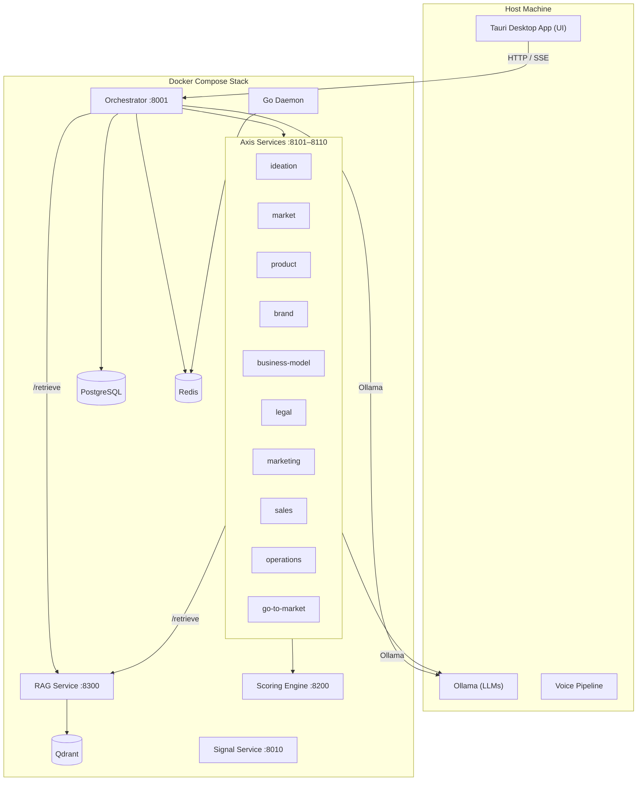

# Moufida: The Intelligent Entrepreneurial Companion

This document provides a comprehensive overview of Moufida's features, architecture, and user interface. It is intended to serve as a detailed guide for understanding the application's capabilities and informing UI/UX improvements.

## 1. High-Level Overview

**What is Moufida?**

Moufida (مفيدة, Arabic for "useful") is a voice-first, 100% locally-run AI companion designed for entrepreneurs, with a special focus on the Tunisian ecosystem. It lives in the user's desktop system tray, providing guidance, analysis, and continuous monitoring throughout the startup journey.

**Core Principles:**

*   **100% Local:** All AI models (LLMs, embeddings, voice) run on the user's machine, ensuring complete data privacy.
*   **Voice-First:** Primary interaction is through spoken commands and speech synthesis, making it feel like a natural conversation.
*   **Grounded & Explainable:** Every piece of advice, score, and recommendation is traceable to its source, whether it's a real-world knowledge base, the user's own data, or academic literature. No black boxes.
*   **Always Alive:** A background daemon continuously monitors the user's project, market, and environment, providing proactive insights and alerts.
*   **Bilingual by Design:** First-class support for French and Tunisian Arabic, acknowledging the linguistic reality of its target users.

## 2. Core Features

Moufida operates in two main modes, supported by a rich ecosystem of background services and interactive tools.

### 2.1. Creation Mode (For New Ideas)

For entrepreneurs starting from scratch.

*   **Guided Axis Generation:** The user provides an idea, and Moufida walks them through a nine-step process to build a complete startup plan. Each step corresponds to a business axis (e.g., Ideation, Market, Product, Business Model).
*   **Interactive Review:** Each generated section is presented for review. The user can **Approve** it, **Edit** it with constraints (triggering a regeneration), or **Retry**.
*   **Grounded Content:** Every generated section is based on evidence from a curated knowledge base of Tunisian resources and live web search results, with all sources cited.
*   **Final Roadmap:** Upon approval of all nine axes, Moufida generates a personalized, time-horizoned roadmap to guide the entrepreneur's next steps.

### 2.2. Diagnosis Mode (For Existing Projects)

For entrepreneurs who already have a project underway.

*   **Adaptive Intake:** Moufida conducts a dynamic voice questionnaire that adapts based on the user's previous answers (e.g., sector, revenue, team size).
*   **Maturity Staging:** The system classifies the project into one of six maturity stages (from Ideation to Growth) and provides the specific evidence from the user's profile that justifies the classification.
*   **Multi-Dimensional Scoring:** The project is evaluated across five composite scores:
    *   **Market Score**
    *   **Commercial Offer Score**
    *   **Innovation Score**
    *   **Scalability Score**
    *   **Green Score**
*   **Explainable Breakdowns:** Each score is fully transparent. The user can see the sub-dimensions, their academic-based weights, the quality of the evidence provided (`declared` vs. `verified` vs. `observed`), and a plain-language justification for the score.
*   **Blocker & Anomaly Detection:** The system identifies priority blockers (financial, legal, market, etc.) and flags contradictory information (e.g., claiming high revenue with no customer validation).
*   **Document Upload:** Users can upload their business plan or pitch deck. Moufida extracts the text and uses it as evidence to enrich the diagnosis.
*   **Score Debate:** If a user disagrees with a score, they can "debate" it in the chat. If the user provides a convincing argument, the score is updated, and the rationale is logged.

### 2.3. Continuous Liveness (The Go Daemon)

A lightweight, always-on background service written in Go that acts as an automated analyst.

*   **Five Watchers:** It continuously monitors:
    1.  **Budget:** Alerts when spending thresholds are crossed.
    2.  **Competitors:** Detects new product launches or news from competitor websites and RSS feeds.
    3.  **Legal Radar:** Scans regulatory feeds for new laws relevant to the user's startup.
    4.  **Milestones:** Provides reminders for upcoming deadlines.
    5.  **Trends:** Scans news feeds for keywords relevant to the user's industry.
*   **Reactive Updates:** When the daemon detects a significant event, it publishes a signal. The orchestrator forwards this to the relevant axis, which can trigger a re-scoring, an alert to the user, or an update to the roadmap, all without user intervention.

### 2.4. The Animated Desktop Companion

To make the experience more engaging and less solitary, Moufida is embodied as a 2D animated pixel-art character who lives on the desktop.

*   **Persistent Presence:** The character is always visible, roaming the desktop even when the main app window is closed.
*   **Expressive States:** She has a wide range of animations and poses that reflect the application's state:
    *   `idle`, `walking`, `sleeping`
    *   `listening`, `thinking`, `speaking`
    *   `celebrating` (for milestones), `worried` (for score drops), `alert` (for critical notifications)
    *   `skeptic`, `presenting`, `reading` (contextual costumes/poses for different app pages)
*   **Reactive Behavior:** The character's state is driven by application and daemon events. A critical alert from the daemon will make her jump and wave to get the user's attention. Completing a diagnostic makes her celebrate.

### 2.5. Tool Integrations

Moufida connects to the tools entrepreneurs already use, becoming a central intelligence hub.

*   **Supported Tools:** Slack, Notion, Google Sheets, Google Analytics, GitHub.
*   **Bidirectional Sync:** Data flows from these tools into Moufida for analysis (e.g., GitHub commit frequency affects the Product Readiness score). In turn, Moufida can send briefings, alerts, and reports back to tools like Slack or Notion.

## 3. Advanced Analytical Features

These are deep, interactive modules that provide high-value, specialized coaching.

*   **Investor Pitch Simulator:** The user can practice their pitch against an AI investor persona (e.g., Seed VC, Angel Investor). The AI's questions are grounded *only* in the user's actual diagnostic data (scores, blockers, etc.), forcing them to confront the weakest parts of their story. The session ends with a readiness report.
*   **Pivot Scenario Planner:** A "what-if" tool where the user can model changes to their strategy (e.g., "What if we target a different market segment?"). Moufida projects the impact of the change on all five scores, with confidence levels and reasoning, allowing the user to de-risk pivots.
*   **Customer Persona Simulator:** Based on the project's data, Moufida generates several distinct customer personas. The user can then "chat" with each persona to hear realistic objections, buying triggers, and pain points, helping them refine their value proposition and sales strategy.

## 4. UI/UX Analysis & Improvement Plan

The existing UI is functional but has been identified as "flat" and "impersonal," failing to surface the backend's true power and personality. A major UI overhaul is planned.

**Key Problems of the Current UI:**

1.  **A Wall of Cards:** The dashboard is a single, long, vertically scrolling page with no clear information hierarchy.
2.  **Underused Character:** The expressive animated character is hidden away, while a less expressive version is used on the most critical user journeys.
3.  **Invisible Power:** Many powerful backend features like score debate, document upload, and diagnostic comparison have no UI and are therefore inaccessible to users.

**The Improvement Plan:**

The core decision is to **standardize on a single, highly expressive pixel-art character** and make her the central, narrative element of the entire user experience.

1.  **One Character, Everywhere:** The pixel-art Moufida will be the single persistent companion, present on every screen. Her state will be driven by everything happening in the app, making her feel alive and reactive.
2.  **Give Moufida a Voice:** The character will narrate the creation flow, congratulate the user on approvals, offer encouragement on retries, and explain *why* each step is important. She becomes an advisor, not just a mascot.
3.  **Restructure Navigation:** Deep, interactive tools (Personas, Pitch, Scenarios) will be moved from the dashboard to their own dedicated pages, making the dashboard a focused "health & next actions" hub.
4.  **Surface Hidden Features:** Add the UI for score debate, document upload, diagnostic comparison, and browsing the knowledge base.
5.  **Gamification & Polish:** Introduce milestone badges, score count-up animations, and per-page themes/costumes for the character to make the journey feel more rewarding and engaging.

## 5. Architecture Overview

Moufida is a microservices-based system orchestrated by a central FastAPI service, all running locally via Docker Compose.

*   **Frontend:** A Tauri (React + Rust) desktop application.
*   **Orchestrator:** A FastAPI and LangGraph service that acts as the brain, routing requests and managing workflows.
*   **Axis Services:** Ten specialized microservices, each responsible for one domain of the startup (e.g., `market-intelligence-service`).
*   **Scoring Engine (Affinitree):** A deterministic, explainable scoring engine based on academic literature.
*   **RAG Service:** Manages the curated knowledge base of Tunisian resources using a Qdrant vector database.
*   **Go Daemon:** The lightweight, always-on monitoring service.
*   **Signal Service:** A Rust microservice providing advanced interpretability layers (Concept Bottlenecks and Axis Directions).
*   **Datastores:** PostgreSQL for persistent data, Redis for messaging, and Qdrant for vector search.
*   **Ollama:** Serves the local LLMs (`llama3.1:8b`) and embedding models (`bge-m3`).
